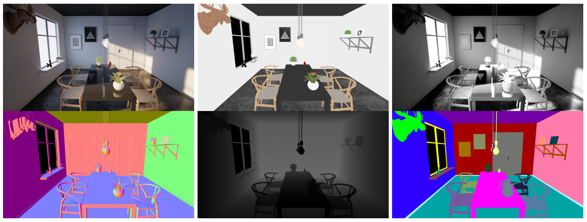

<div align="center">    
 
# UnrealROX+
## An Improved Tool for Acquiring Synthetic Data from Virtual 3D Environments

[](https://arxiv.org/abs/2104.11776)
[](https://arxiv.org/abs/2104.11776)


 
</div>
 
## Description   


## How to use   


## Publication
<div align="center">

 ### [**UnrealROX+: An Improved Tool for Acquiring Synthetic Data from Virtual 3D Environments**](https://arxiv.org/abs/2104.11776)
 
 International Joint Conference on Neural Networks (IJCNN) - 2021
 
 *Pablo Martínez-González, Sergiu Oprea, John A. Castro-Vargas, Alberto García-García, Sergio Orts-Escolano, José García-Rodríguez, and Markus Vincze*

</div>

### How to cite this work?
If you use UnrealROX+, please cite:
```
@article{Martinez2021unrealrox,
  author    = {Pablo Martinez{-}Gonzalez and Sergiu Oprea and John A. Castro{-}Vargas and Sergio Orts{-}Escolano and Jose Garcia Rodriguez} and Markus Vincze},
  title     = {{UnrealROX+:} An Improved Tool for Acquiring Synthetic Data from Virtual 3D Environments},
  journal   = {CoRR},
  volume    = {abs/2104.11776},
  year      = {2021}
}
```

Any criticism and improvements is welcome using the issue system from this repository. For other questions, contact the corresponding authors:

- Pablo Martinez-Gonzalez [Design, UE4 Backend, Lead Programmer] ([pmartinez@dtic.ua.es](mailto:pmartinez@dtic.ua.es))
- Sergiu Oprea [Design, Grasping, Support Programmer] ([soprea@dtic.ua.es](mailto:soprea@dtic.ua.es))
- Alberto Garcia-Garcia [Design, Prototyping, Project Lead] ([agarcia@dtic.ua.es](mailto:agarcia@dtic.ua.es))
- John A. Castro-Vargas [Design, Support Programmer] ([jacastro@dtic.ua.es](mailto:jacastro@dtic.ua.es))
- Alvaro Jover-Alvarez [UE4 Expert, Support Programmer] ([ajover@dtic.ua.es](mailto:ajover@dtic.ua.es))
- Sergio Orts-Escolano [Design, Technical Advice] ([sorts@ua.es](mailto:sorts@ua.es))
- Jose Garcia-Rodriguez [Technical Advice] ([jgarcia@dtic.ua.es](mailto:jgarcia@dtic.ua.es))
